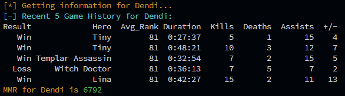

# discord_dota.py

## Retrieve DOTA 2 statistics on players via OpenDota API

Creates a Dota Player object when you input a name and OpenDota ID;
  Interacts with OpenDotaAPI
  You can retrieve this key on their website by finding the player
  
- [OpenDota](https://opendota.com)

## Usage

To Import module:

`from discord_dota import DotaPlayer as dp`

Enter Values in discord_dota.py:

```python
#Example
player_name = "dendi" # Arbitrary name to give your lookup
player_id = "70388657" # The unique player id from an Opendota URL
```

## Example Output



## TODO

- Implement command line argument parsing

## Disclaimer

> Don't use to be naughty. Be nice to one another. For educational purposes only.
